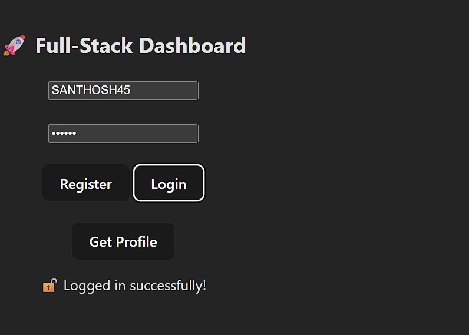

# 🚀 Fullstack Authentication System

A complete **MERN-stack Authentication App** built using **React (Vite)**, **Node.js**, and **MongoDB Atlas**, featuring secure JWT login and deployed fully on **Render**.

---

## 🌍 Live Demo

| Service        | URL                                                                                                  |
| -------------- | ---------------------------------------------------------------------------------------------------- |
| 🖥️ Frontend   | [https://fullstack-px2h.onrender.com](https://fullstack-px2h.onrender.com)                           |
| ⚙️ Backend API | [https://fullstack-auth-project-7ipc.onrender.com](https://fullstack-auth-project-7ipc.onrender.com) |

---

## 🧠 Project Overview

This project demonstrates **secure authentication flow** — registration, login, token-based session, and protected API routes — built for **portfolio-grade production deployment**.

---

## ✨ Features

✅ User registration & login
✅ JWT authentication with `localStorage`
✅ Password encryption (bcrypt)
✅ Protected route: `/api/profile`
✅ MongoDB Atlas integration
✅ Render deployment (frontend + backend)
✅ Clean folder structure for scalability

---

## 🧩 Tech Stack

| Layer      | Technology                       |
| ---------- | -------------------------------- |
| Frontend   | React (Vite), Axios, TailwindCSS |
| Backend    | Node.js, Express.js, Mongoose    |
| Database   | MongoDB Atlas                    |
| Security   | JWT, bcryptjs                    |
| Deployment | Render                           |

---

## 🗂 Folder Structure

```
fullstack-auth-project/
│
├── client/                  # React frontend (Vite)
│   ├── src/
│   ├── .env
│   └── package.json
│
├── server/                  # Express backend
│   ├── server.js
│   ├── userModel.js
│   ├── .env
│   └── package.json
│
└── README.md
```

---

## ⚙️ Environment Variables

### 🧱 Backend (`server/.env`)

```
MONGO_URI=your_mongodb_connection_string
JWT_SECRET=your_secret_key
PORT=5000
```

### 🖥️ Frontend (`client/.env`)

```
VITE_API_BASE=http://localhost:5000
# Or for production:
# VITE_API_BASE=https://fullstack-auth-project-7ipc.onrender.com
```

---

## 🚀 Run Locally

### 1️⃣ Clone the Repository

```bash
git clone https://github.com/SanthoshDulam/fullstack-auth-project.git
cd fullstack-auth-project
```

### 2️⃣ Setup Backend

```bash
cd server
npm install
npm run dev
```

### 3️⃣ Setup Frontend

```bash
cd ../client
npm install
npm run dev
```

### 4️⃣ Open in Browser

* Frontend → [http://localhost:5173](http://localhost:5173)
* Backend → [http://localhost:5000](http://localhost:5000)

---

## 📦 Build for Production

```bash
cd client
npm run build
```

This will create a `dist/` folder containing your optimized frontend build.

---

## 💡 Future Enhancements

* 🔐 Add “Forgot Password” & OTP reset
* 👤 User roles (Admin / Regular)
* 📊 Dashboard with activity tracking
* 🧭 CI/CD automation using GitHub Actions


### 🕓 Uptime & Reliability

The backend service **[`https://fullstack-auth-project-7ipc.onrender.com`](https://fullstack-auth-project-7ipc.onrender.com)** is actively monitored and **kept awake 24/7 using [UptimeRobot](https://uptimerobot.com/)** to prevent cold starts.
This ensures that the app remains **instantly accessible** during demos, interviews, and portfolio reviews — no waiting for the server to spin up! ⚡

---

## 🧑‍💻 Author

**Santhosh Dulam**
💼 [LinkedIn](https://linkedin.com/in/santhosh-dulam-94b8b9242)
📧 [santhosh.dulam45@gmail.com](mailto:santhosh.dulam45@gmail.com)
🌐 [GitHub Profile](https://github.com/SanthoshDulam)

---

## 🏷️ Badges


---

---

## 🖼️ Screenshots & Demo

Here’s a glimpse of the working authentication flow 🔐 — fully connected to MongoDB Atlas and deployed on Render.

| Step | Screenshot | Description |
|------|-------------|--------------|
| 🪄 1 |  | **Clean Login/Register interface** built with React (Vite). |
| 🧑‍💻 2 |  | User successfully registers — password is encrypted and stored securely. |
| 🔓 3 |  | User logs in using JWT-based authentication. |
| 🧬 4 |  | After login, profile details are fetched from a protected route `/api/profile`. |
| 📤 5 |  | Token removed from storage — session safely terminated. |
| 💾 6 |  | Actual MongoDB Atlas data — usernames stored with bcrypt-hashed passwords. |

---

